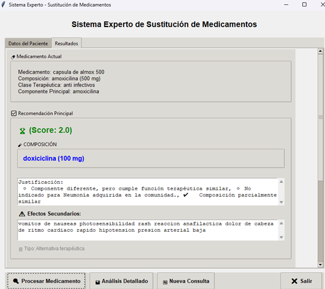

# Sistema Experto Medicamentos 🏥💊

Sistema experto de sustitución de medicamentos que, a partir de reglas clínicas y composición farmacológica, sugiere alternativas terapéuticas seguras, explicables y adaptadas al perfil clínico del paciente.

---

## 📦 Distribución

Se ha generado un único ejecutable para Windows con PyInstaller. No necesitas instalar Python ni bibliotecas adicionales.

- **Archivo ejecutable**:  
  `dist\Interfaz_principal.exe`

---

## 🔧 Requisitos del sistema

| Requisito                   | Detalle                                       |
|----------------------------|-----------------------------------------------|
| Sistema Operativo          | Windows 10 o superior (64-bit recomendado)    |
| CPU                        | Compatible con SSE2                           |
| RAM recomendada            | 4 GB o más                                    |
| Espacio en disco           | 152 MB mínimo                                 |
| Antivirus                  | Permitir ejecución de aplicaciones no firmadas |
| Conectividad               | No se requiere conexión a internet            |

---

## 🚀 Uso básico del sistema

1. Descarga el repositorio completo o solo la carpeta `dist`.
2. Ve al explorador de Windows y ejecuta:

   ```
   dist\Interfaz_principal.exe
   ```

3. Se abrirá la interfaz gráfica.
4. Ingresa los datos clínicos requeridos.
5. Presiona **Validar** y luego **Procesar** para ver la recomendación priorizada.

> 💡 Los archivos CSV han sido empaquetados dentro del `.exe`. No es necesario configurarlos manualmente.

---

## 📋 Ejemplo rápido

1. Selecciona motivo (alergia o desabastecimiento).  
2. Completa síntomas, antecedentes, diagnóstico y medicamento actual. 
3. Valida los datos ingresados
4. Pulsa **Procesar**.  
5. Visualiza:
   - Sustituto sugerido
   - Puntaje clínico y justificación
   - Efectos secundarios  

6. Opcional: Pulsa **Análisis Detallado** para ver todo el razonamiento del sistema.

---

## 📁 Estructura del repositorio

```
Proyecto_Medicamentos_Sustitutos/
├── dist/                            ← Ejecutable compilado (.exe)
│   └── Interfaz_principal.exe
├── Modelo/
│   ├── 01Hechos/
│   │   └── clinical_data.csv
│   ├── BaseConocimiento/
│   │   ├── medicamentos_info.csv
│   │   └── sustitutos_medicamentos.csv
│   └── ReglasClinicas/
│       └── posibles_alergenos.csv
├── Vista/
│   └── interfaz_principal.py
├── Controlador/
│   └── main.py
├── Test/
│   ├── test_Unitarias.py
│   ├── test_Integracion.py
│   └── test_Rendimiento.py
└── README.md
```

---

## 📊 Datasets utilizados

| Dataset            | Descripción                                                                                                   | Enlace                                                                                                             |
|--------------------|---------------------------------------------------------------------------------------------------------------|--------------------------------------------------------------------------------------------------------------------|
| Clinical Data       | Casos clínicos simulados (`diagnoses`, `medications`, `clinical_notes`)                                      | [Ver en Kaggle](https://www.kaggle.com/datasets/rohitphalke1/clinical-data)                                       |
| 250k Medicines      | Medicamentos con sustitutos y efectos secundarios (`substitute0-4`, `sideEffect0-40`, clases, etc.)           | [Ver en Kaggle](https://www.kaggle.com/datasets/shudhanshusingh/250k-medicines-usage-side-effects-and-substitutes) |
| Drug Dataset        | Composición, efectos, usos y reviews de cada medicamento                                                      | [Ver en Kaggle](https://www.kaggle.com/datasets/aadyasingh55/drug-dataset)                                        |

⚠️ Todos los datos fueron traducidos, depurados y normalizados para el motor de inferencia.

---

## 🧪 Pruebas automatizadas

El sistema cuenta con pruebas **unitarias**, **de integración** y **de rendimiento**, utilizando `pytest`.

### 🧬 Ejecutar todas las pruebas

Desde la raíz del proyecto:

```bash
python -m pytest -v
```

### 📂 Ejecutar pruebas por módulo

```bash
python -m pytest Test/test_Unitarias.py -v
python -m pytest Test/test_Integracion.py -v
python -m pytest Test/test_Rendimiento.py -v
```

> ✔️ Las pruebas se ejecutan correctamente desde `Proyecto_Medicamentos_Sustitutos/`

---

## 🛠️ Compilación personalizada

Si deseas modificar el sistema y volver a compilarlo:

1. Instala PyInstaller (requiere Python 3.11+):
   ```bash
   pip install pyinstaller
   ```

2. Desde la raíz del proyecto, ejecuta:

   ```bash
   pyinstaller --onefile --windowed \
     --add-data "Modelo/01Hechos/clinical_data.csv;Modelo/01Hechos" \
     --add-data "Modelo/BaseConocimiento/medicamentos_info.csv;Modelo/BaseConocimiento" \
     --add-data "Modelo/BaseConocimiento/sustitutos_medicamentos.csv;Modelo/BaseConocimiento" \
     --add-data "Modelo/ReglasClinicas/posibles_alergenos.csv;Modelo/ReglasClinicas" \
     Vista/interfaz_principal.py
   ```

3. El nuevo `.exe` se generará en la carpeta `dist/`.

---

🎯 **Este sistema representa una solución viable y explicable para asistir a profesionales de salud en la sustitución de medicamentos, especialmente en zonas con infraestructura limitada.**
